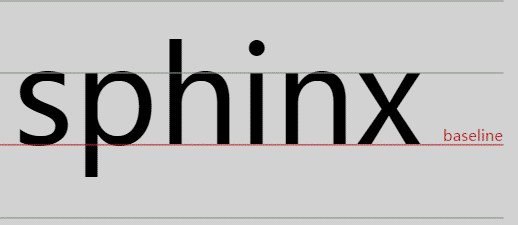
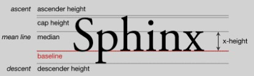

# 5.内联元素与流

块级元素负责结构，内联元素接管内容(上帝发明了食物,模特发明了调味料)，面向图文混排是内联元素设计。

## 5.1字母X

### 5.1.1字母X与CSS世界的基线

1. 涉及垂直方向的排版或者对齐都离不开最基本的基线
2. **line-height**行高定义两个基线的间距,**vertical-align**默认值就是*baseline*
3. 字母x的下边缘就是基线


### 5.1.2 字母x与css的x-height

1. x-height小写字母x的高度,是基线和等分线之间的距离


+ ascender height:上下线高度
+ cap height:大写字母高度
+ median:中线
+ descender height:下行线高度

2. vertical-align:middle指基线往上1/2 x-height高度，近似为字母x交叉点那个位置

### 5.1.3 字母x与css中ex

1. ex是css尺寸单位,指的是小写字母x的高度，就是指x-height
2. ex作用--不受字体和字号影响的内联元素的垂直居中对齐效果
3. 内联元素默认是基线对齐的，基线就是x底部，1ex就是一个x的高度

## 5.2 内联元素的基石line-height

### 5.2.1 内联元素的高度之本

1. div元素中包含了文字就会让div有了高度,本质上有line-height属性决定的

```css
<div class="test1">我的高度是?</div>
<br />
<div class="test2">我的高度是2?</div>
.test1 {
    font-size:16px;
    line-height: 0;
    border:1px solid #ccc;
    background: #eee;
}
.test2 {
    font-size:0;
    line-height: 16px;
    border:1px solid #ccc;
    background: #eee;
}
```

两个例子一个line-height为0，一个font-size为0，显示出来的页面是test1显示div
的高度为0，但是字体还在，test2字体由于font-size显示0导致消失，但是div的高度
已经存在。

2. 行距=line-height-em-box,可以理解成line-height-font-size.

em-box是一个虚拟的概念，但是1em等于当前一个font-size大小，传统行距和css行距区别

|行距|构成|第一行|
|----|----|-----|
|传统行距|独立的区域|没有|
|css行距|由上下两行组成|有|
